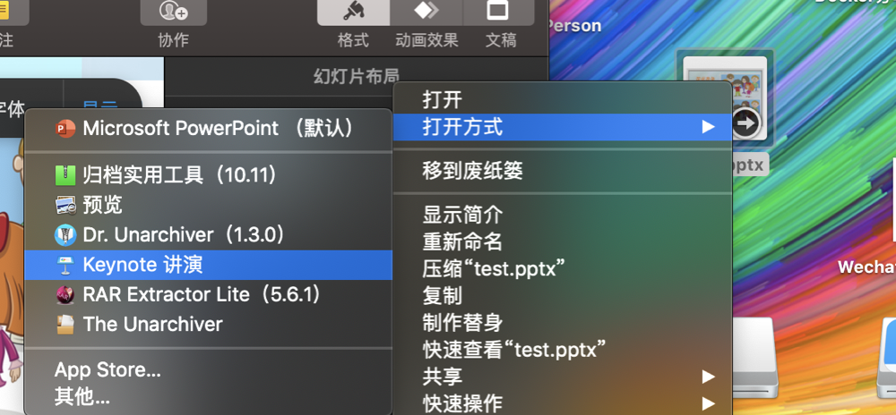
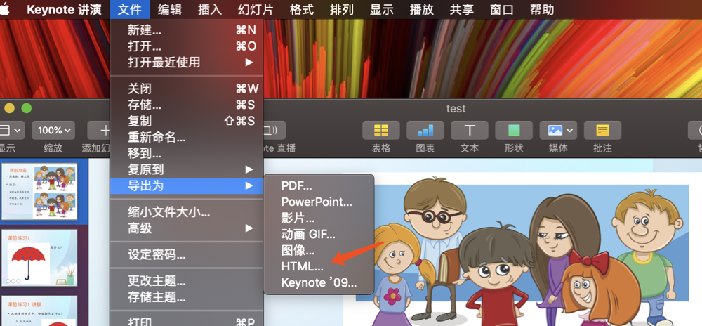

PPT -Live

在线教育直播间中PPT是不可缺少的一个重要功能；

```
可能有人会问为什么要单独开发一个PPT模块呢，直接将老师的屏幕共享过去这样岂不是更好？
```


### 其实这么做是不妥当的原因有如下：

1、老师上课使用一般是PC，直接投屏至手机端上面观看清晰度较差；

2、大大的限制学生端的UI布局

3、对于之后Sass服务化后，UI布局定制化较差；

4、若单独将PPT也当作视频推送到用户端，学生同时要收双流，对学生网络带宽来说压力较大；


考虑到上诉原因，我们决定单独将PPT拆分成独立服务；


### PPT独立化服务后，我们需要面临如下几个问题

1、PPT需要转化成一个webView可以渲染的网页

2、哪些工具可以实现转码呢？

3、即使转码后这种网页应该要提供几种定制化的接口？

4、PPT的切换依赖于信令的变化，如何将其结合起来

5、如何做好缓存？


#### 问题1&2通过调研

将PPT直接转码成一个html网页实际上有较多的工具

| 方案名称    | 优点                         | 缺点                          | 预算               |
| ----------- | :--------------------------- | ----------------------------- | ------------------ |
| PP匠        | 快速实现，转码效果好         | 厂太小，怕不稳定              | 可接受             |
| 网易PPT     | 同时实现ppt&白板             | 成本较贵50w起用               | 不可接受           |
| Ispring     | 兼容好，快速实现，有转码进度 | 企业在国外，担心不稳定        | 偏贵一些，但可接受 |
| openOfficce | 自己定义解码标签扩展好       | 短时间难以形成稳定产品        | 可接受             |
| mac+keynote | 兼容好，快速实现，成本低     | 无cli命令行调用，需要自己搭建 | 可接受             |

经终合评估我们决定舍不得mac+keynote方案

##### mac+keynote方案到底是个啥？

这其实是在不经意见发现的,一次尝试过程中发现keynote可以打开pptx等文件，并且产品可以导出另存为HTML文件，效果正经还不错呢，看如下步骤





如上操作大家可以自行尝试，对导出来的文件稍加分析，通过关键的描述文件你大致可知：

1、些文件共有**页

2、如何控制在每一页的跳转

3、如何控制每一页的动画

在此基础上，进行代码模板注入你即可根据信令控制PPT的展示；


##### 此时你肯定会有一个疑惑，你这种不有实现Cli的方式调用有啥用呢？

别急，肯定要将此功能服务化，做成命令行可调用方式； 但在此基础上我们至少可以学会如何去控制它了；

##### 如何将其服务化？

提到windows上面，有不少同学肯定记得*.bat脚本，mac上面也是如此；再想想，如果说我们可以通过AppStript，将指定的pptx文件转码那大致方案就可行了；

```typescript
-- THE DESTINATION FOLDER 
-- (see the "path" to command in the Standard Additions dictionary for other locations, such as pictures folder, movies folder, sites folder, desktop folder)
set the defaultDestinationFolder to (path to documents folder)

tell application "Keynote"
	activate
	try
		if playing is true then tell the front document to stop
		
		if not (exists document 1) then error number -128
		
		-- DERIVE NAME FOR NEW FOLDER FROM NAME OF THE FRONT DOCUMENT
		set documentName to the name of the front document
		if documentName ends with ".key" then ¬
			set documentName to text 1 thru -5 of documentName
		
		-- CREATE AN EXPORT DESTINATION FOLDER
		-- IMPORTANT: IT’S ADVISED TO ALWAYS CREATE A NEW DESTINATION FOLDER, AS THE CONTENTS OF ANY TARGETED FOLDER WILL BE OVERWRITTEN
		tell application "Finder"
			set newFolderName to documentName
			set incrementIndex to 1
			repeat until not (exists folder newFolderName of defaultDestinationFolder)
				set newFolderName to documentName & "-" & (incrementIndex as string)
				set incrementIndex to incrementIndex + 1
			end repeat
			set the targetFolder to 
				make new folder at defaultDestinationFolder with properties ¬
					{name:newFolderName}
			set the targetFolderHFSPath to targetFolder as string
		end tell
		
		-- EXPORT THE DOCUMENT
		with timeout of 1200 seconds
			export front document as HTML to file targetFolderHFSPath
		end timeout
		
	on error errorMessage number errorNumber
		display alert "EXPORT PROBLEM" message errorMessage
		error number -128
	end try
end tell

-- OPEN THE DESTINATION FOLDER
tell application "Finder"
	open the targetFolder
end tell

-- VIEW THE PRESENTATION
tell application "Safari"
	activate
	open file (targetFolderHFSPath & "index.html")
end tell
```

具体使用可参考： http://iworkautomation.com/keynote/table.html

#### 一起来梳理一下这个服务流程

1、通过jenkins+salve+iMac主机连接起来

2、jenkins对外暴露服务触发接口

3、jenkins向salve发送执行请求

4、在iMac机器上面进行转码

5、将转码后数据进行模板注入打包回传至cdn

6、课程与资源进行绑定

7、客户端进入直播间通过通信去控制ppt的跳转。


#### 需要注意事项

1、iMac上面转码的并发控制，防止同一台主机有多个转码任务介入。

2、iMac需要有人工内网远程介入权限，防止一些异常导致转码任务失败，人工介入使其恢复；

3、iMac上面需要有完全的转码日志，方便故障分析；

4、禁止iMac系统自动升级，通过主机hosts上面配置禁止其自动升级；因为一但升级，可能会导致需要重新编写注入模板；


至此，PPT的大致服务介绍到此为止，后续我们会详细介绍客户端（Android&ios）上是如何与之结合使用；

