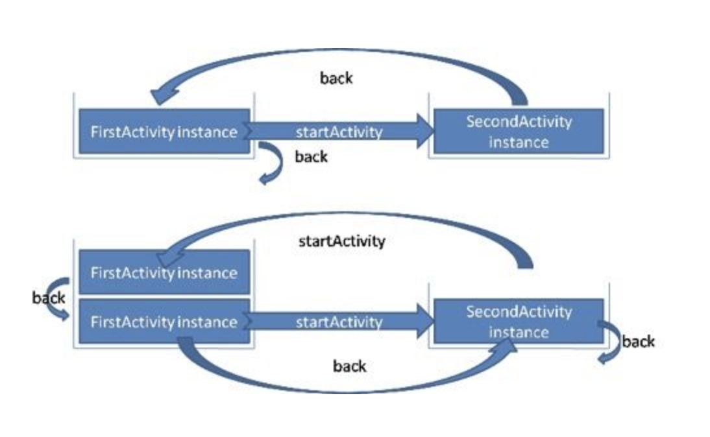

Activity四种启动模式以及使用场景

##### 标准模式：(Standard)

使用这种模式，调起时每次都会重建不管之前是否有存在过；

其所在的任务栈与启动他的Activity在同一个栈中；

若在Application中使用启动Activity需要单独时需要单独给Activity添加FLAG_ACTIVITY_NEW_TASK标志位，用于开辟一个新任务栈

##### 栈顶复用模式（singleTop）

在这个模式中，Activity还是会创建在启动它的Activity的任务栈中，但是如果它已经位于栈顶，那么就不会重复创建，并且它的onNewIntent会被调用，但是要注意它的生命周期方法onCreate等等不会创建。并且如果它并不位于栈顶，如ABC，这时启动B，还是会创建一个新的实例。

##### 栈内复用模式（singleTask）

在这个模式中，比如启动Activity A，首先系统会寻找是否存在A想要的任务栈：

如果存在，就看任务栈中是否有A，如果有就有clearTop的效果，把A推到栈顶，并且调用onNewIntent，即CABD的任务栈，clearTop之后就是CA；如果没有A，就创建A在栈顶。并且要注意一点，如果存在A的任务栈，那么任务栈自动回切换到前台，如下图所示：

Y的任务栈直接被切换到了前台，这点和微信的聊天界面是一样的。

如果不存在，就创建A所需要的任务栈并且创建A入栈。

###### 使用场景：

一般来说栈内复用适用于在一个应用里我们希望唯一存在的界面，比如聊天界面，比如微信的聊天界面，我们在一个聊天界面点击了头像进入了新的界面，这个时候来了一条新的消息并且用户点击了消息，这个时候如果是Standard模式就会创建一个新的实例，这样用户在新的界面点击back，用户期望回到的是主界面，而实际上回到了之前的头像界面，这就不符合常规了。如果把聊天设为栈内唯一模式，那么用户点击之后就会回到之前的聊天界面并且做一些改变，保证了聊天界面的唯一性。浏览器的例子也是这样，我们肯定希望浏览器浏览的界面是唯一的，也需要用到这个模式。

##### 4）单实例模式（singleInstance）

启动时，无论从哪里启动都会给A创建一个唯一的任务栈，后续的创建都不会再创建新的A，除非A被销毁了

我们看到从MainActivity跳转到SecondActivity时，重新启用了一个新的栈结构，来放置SecondActivity实例，然后按下后退键，再次回到原始栈结构；图中下半部分显示的在SecondActivity中再次跳转到MainActivity，这个时候系统会在原始栈结构中生成一个MainActivity实例，这时点击back发现一个神奇的现象，回到的还是MainActivity，然后再点击一次，**注意，并没有退出，而是回到了SecondActivity**，为什么呢？是因为从SecondActivity跳转到MainActivity的时候，在第一个返回栈中创建了新的实例，而Second所在的成为了后台栈，所以说singleInstance不要用于中间页面，如果用于中间页面，跳转会有问题，比如：A -> B (singleInstance) -> C，完全退出后，再次启动，首先打开的是B。

**使用情况：**

假设，我们希望我们的应用能和另一个应用共享某个Activity的实例。

这样说，可能很难以理解，那么举例来说：

1.现在我们的手机上有“某某地图”以及我们自己的应用。
2.我们希望在我们的应用里共享“某某地图”当中的地图功能界面。

那么，假定的操作就应该为，例如：
1.首先，假设我们

在“某某地图”里已经做了一定操作，地图界面被我们定位到了成都市。
2.我们返回了HOME界面，打开了自己的应用，在自己的应用里打开了”某某地图”的地图界面。
3.那么，所谓共享该Activity实例，我们要达到的效果就是，当我们打开地图界面，此时地图上显示的位置就应该是我们之前定位到的成都市。而不是地图的初始化显示方位。

那么，显然，通过此前的3种启动模式，我们是实现不了的。因为：
我们最初在“某某地图”中进行定位时，activity是位于该应用的返回栈里的。
当我们在自己的应用再次调用地图界面，系统的操作是，在我们自己的应用的返回栈里新建一个地图界面Activity的实例对象。
所以实际上两个“地图界面”是位于两个不同应用的各自的返回栈里的，两个毫无关联的Activity实例。

MainActivity位于Task“8”当中，当我们在自己的应用MainActivity当中调用SecondActivity，系统新建了返回栈Task“9”，并在该返回栈中放入一个全新的SecondActivity的实例对象。
此时，当我们再打开SecondActivity本身所在的应用，调用SecondActivity，系统则会复用Task“9”当中的对象，而不会去做其他操作了。
从而，也就是实现了我们的目的，在两个应用间共享某个Activity。