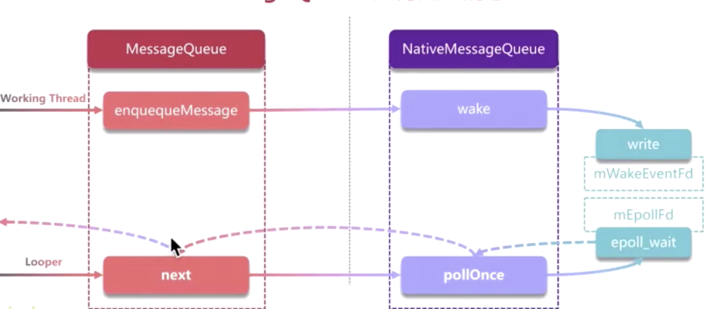

UI线程与非UI线程

UI线程的工作机制

Zygote->fork->App->ActivityThread(main)->Lopper(loop)

#### 主线程如何工作的呢？

#### 为什么设计成线程不安全的?

- UI有可变性，或者说是高频的可变性（如游戏60fps）
- UI对响应的时间特别敏感，因此要求UI更新要高效
- UI的绘制必须是批量的绘制来保证高效率

非UI线程一定不能更新UI么？

不是的，

- io线程可以通过主线程Handler.postMessage去更新；

- UI.View postInvalide可以进行更新强制刷新，间接更新；

- SurfaceView 使用的是线程直接去画；

  Prepare content-> lockCanval->draw->unLockCanvasAndPost

- GLSurfaceview(GLThread.run) Base on OpenGl 

- TextTureView 

https://www.jianshu.com/p/8fa3eed3c975

