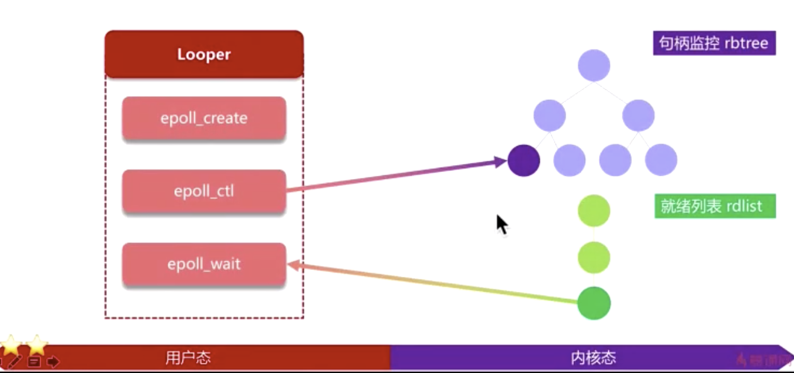

主线程为什么不会产生ANR

##### ANR产生条件

- 前台服务20S(Service) scheduleTimeOutService 

- 后台服务200S(Service)

- 广播队列

  前台10后台60S

- ContentProvider TimeOut 10s

- InputDispatching TimeOut: 5S

##### Looper与Anr的关系

Looper是在ActivityThread中的一个死循环，处理各类消息，相当于一个整体进程

Anr是相当于执行到某个环节的时候，对开发者的操作监控

##### App进程机制了解

##### Looper消息工作机制的理解

##### Linux多路复用

https://blog.csdn.net/wyz0516071128/article/details/81058898

##### Looper为什么不会导致CPU占用率较高？

无消息的时候，Looper实际上是阻塞状态这种状态不会消耗cpu的时间片，有消息的时候才会处理；

在底层会有一个epoll ,wait模型；

