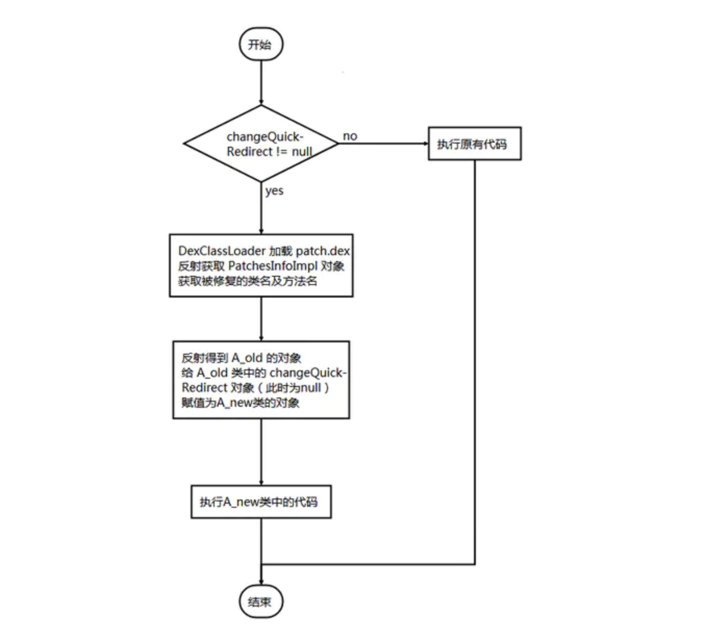
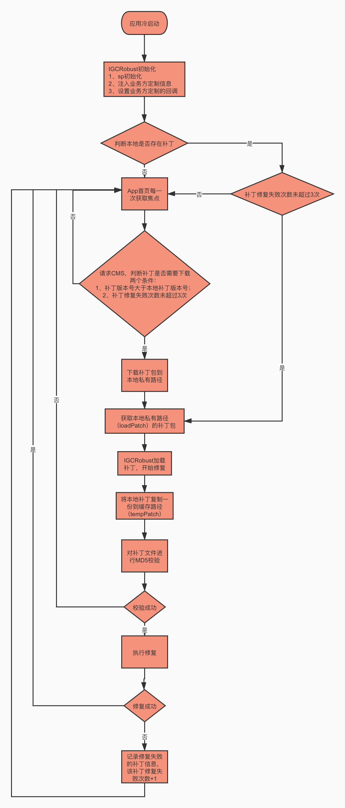

HotFix立项背景

- 提升解决线上问题的效率；快速迭代过程中在线上出现的Bug需要快速解决，而全量带来的发版周期过长；
- 减少因Bug而打乱当前的发版节奏的风险；

#### 热修的选型

- - | **Type** | **Nuwa**                                           | **Robust**                                                   | **Andfix**                                      | **Tinker**                                |
    | -------- | -------------------------------------------------- | ------------------------------------------------------------ | ----------------------------------------------- | ----------------------------------------- |
    | Company  | Null                                               | Meituan                                                      | Alibaba                                         | Tencent                                   |
    | 开发时间 | 2015                                               | 2016                                                         | 2015                                            | 2016                                      |
    | 替换类   | √                                                  | X                                                            | X                                               | √                                         |
    | 替换So   | X                                                  | X                                                            | X                                               | √                                         |
    | 替换资源 | √                                                  | X                                                            | X                                               | √                                         |
    | 即时生效 | X                                                  | √                                                            | √                                               | X                                         |
    | 成功率   | 较高                                               | 最高                                                         | 一般                                            | 较高                                      |
    | 接口文档 | ★★                                                 | ★★                                                           | ★★                                              | ★★★★                                      |
    | 优点     | 开发透明，简单、热修复成功率高                     | 兼容性高，开发透明； 实时生效。                              | 立即生效，消耗低； 补丁包较小。                 | 补丁包较小，消耗较小； 开发透明，文档丰富 |
    | 缺点     | 在Art 上表现为补丁包较大； 在Dalvik 上性能消耗较大 | 1、会增大方法数，影响运行效率； 2、暂不支持 so 文件和资源的替换 | 仅支持方法替换； 兼容性不佳，对部分机型暂不支持 | 占用 ROM 较大； 需要重启才能生效。        |

#### Robust的大致原理

Robust 插件对每个产品代码的每个函数都在编译打包阶段自动的插入了一段代码。

通过判断 `if(changeQuickRedirect != null)` 来确定是否进行热修复，当 changeQuickRedirect 不为 null 时，调用 patch.dex 中同名类的同名方法达到 hotfix 的目的。

如何调用呢？ 生成的patch.dex 中有两个主要类，PatchesInfoImpl.java 和修复后的同名类 APatch.java。客户端拿到patch.dex 后，用DexClassLoader 加载patch.dex，反射拿到PatchesInfoImpl.java 这个 class。并创建这个class 的一个对象。然后通过这个对象知道被替换的是谁，给它的变量changeQuickRedirect 赋值为 patch.dex 中的 APatch 的对象，这样就会去执行补丁包中的方法了。

大致流程图如下所示：A_old 表示未被修复的原有类，A_new 表示已修复的新类

#### Robust的使用限制

- 暂时不支持新增字段，但可以通过新增类解决
- 暂时不支持修复构造方法，已经在内测
- 暂时不支持资源和 so 修复，不过这个问题不大，因为独立于 dex 补丁，已经有很成熟的方案了，就看怎么打到补丁包中以及 diff 方案。
- 对于返回值是 this 的方法支持不太好
- 没有安全校验，需要开发者在加载补丁之前自己做验证
- 可能会出现深度方法内联导致的不可预知的错误(几率很小可以忽略)

#### 为贴近我业务我们都做了哪些工作

##### 1、改进打包Plugin

- [ ] 支持在Debug模式下不对代码进行插入缩短平时开发的编译时间；

- [ ] 支持命令行指定方式构建Patch包

  

##### 2、构建半自动化打包流程

- [ ] Release所有构建，自动同步Apk、Mapping、methodsMap.robust至oss平台；

- [ ] 支持一按建构建Patch包，仅需输入Jenkins.jobId、修复后的git commit号

- [ ] 支持用户级别的热修灰度验证

  

##### 3、输出集成文档

- [ ] 希哥补充

##### 4、推进热修复开发工作流的git规范

##### 5、热修效果数据打点

##### 6、Patch的下载策略以及回滚策略定义

#### 如何集成&配置

- [ ] http://wiki.luojilab.com/pages/viewpage.action?pageId=50359025

#### 实战修复效果

#### 后续改进方向

- [ ] 将IGCRobust打包插件拆分
- [ ] 对一些异常报错加强输出
- [ ] 扩展多渠道的构建

感谢：

@信希  @小马  @大爷  

